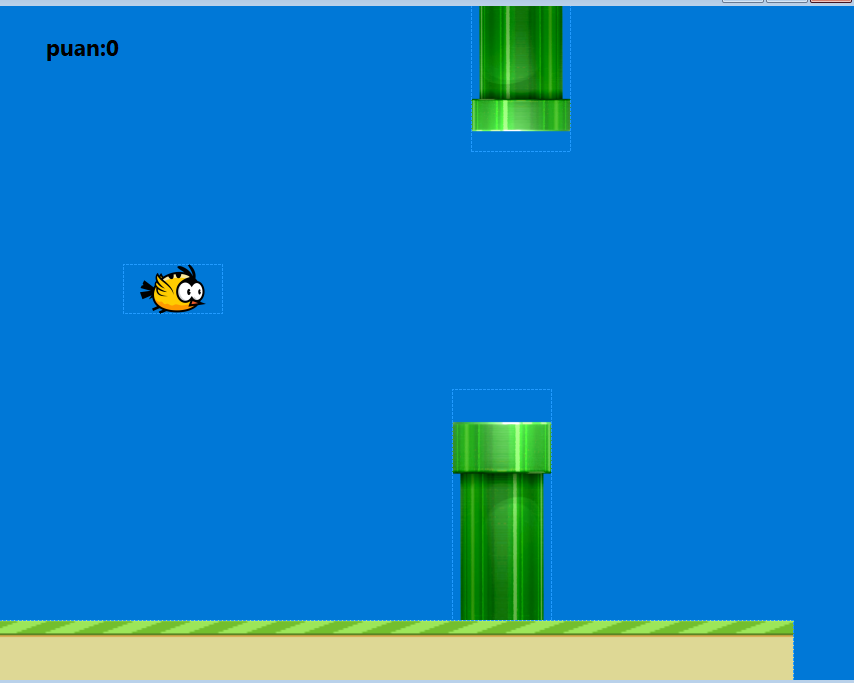

# 🐦 Flappy Bird – C# (WinForms)

Bu proje, **C# ve Windows Forms (WinForms)** kullanılarak geliştirilmiş basit bir **Flappy Bird klonudur**.  
Amaç, kuşu borulara çarptırmadan mümkün olduğunca uzun süre oyunda tutmaktır.

---

## 🎮 Oyun Özellikleri

- ⏱️ Timer tabanlı oyun döngüsü
- 🐦 Space tuşu ile zıplama
- 🧱 Hareketli borular
- 📊 Skor sistemi
- 💥 Çarpışma algılama
- 🔁 Game Over & yeniden başlatma

---

## 🖼️ Oyun Görseli

---

## 🛠️ Kullanılan Teknolojiler

- **C#**
- **Windows Forms (WinForms)**
- .NET Framework

---
